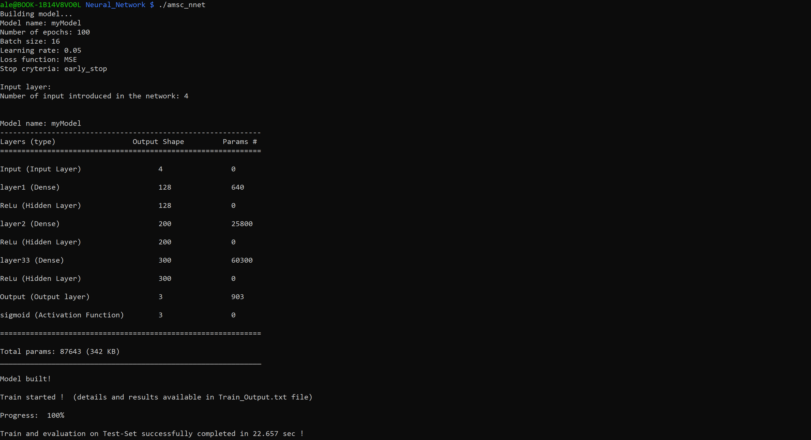
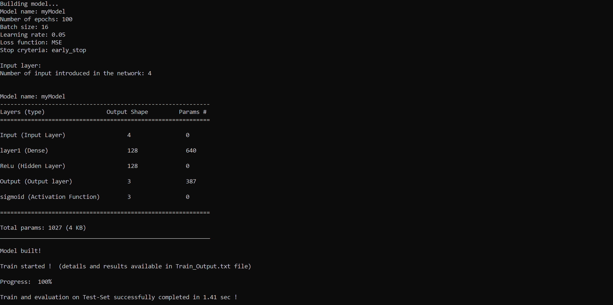

# NEURAL NETS PROJECT

## FOLDER STRUCTURE
All of our work is located in the "Common" folder in this repository, which includes 4 folders:
- Include: Contains all header files used in the project.
- src: Contains the source code for the matrix multiplication algorithms, profiler, and network's activation functions.
- matrix mult: Contains several different implementation of Matrix x Matrix multiplication
- test: Contains all the unt test and profiling done on the different implementations
- Neural Network: inside here the main function that implement the neural network

## DESCRIPTION OF THE WORK
Our work was divided into three main phases:
- Writing code for different versions of matrix-matrix multiplication algorithms.
- Profiling the performances of all the different versions.
- Building the neural network.

## NEURAL NETWORK
We implemented a Feed Forward Neural Network, and matrix multiplications are handled by the functions developed in the first part of the project. The weights are updated through a Gradient Descent optimization implemented in a batch-wise solution.

In the context of neural network implementation:

The network.hpp file comprises classes for handling input, output, and layers. The Input class manages training, validation, and test data, allowing easy retrieval and shaping of input sets. The Output class handles target data for training, with activation functions for output layers. The Layer class represents a neural network layer, specifying its name, neuron count, and activation function.

Moving to model.hpp:
The Model class integrates Input, Output, and Layer classes to create a flexible neural network model. It supports dynamic layer addition and provides insights into the model's structure. Key methods include model construction, weight initialization, and execution of predictions and training.

In asmc_nnet.cpp:
Utility functions like, readIrisData, and getIrisSets facilitate dataset generation, normalization, and Iris dataset handling. The main function reads and splits the Iris dataset, creates a customizable neural network model, builds and trains the model using the provided datasets.

It is possible to compile the code with:

```bash
#Go first in Common/Neural_Network folder and compile as follow

g++ -O3 -std=c++17 -I ../include -march=native -ffast-math amsc_nnet.cpp ../src/irisLoader.cpp ../src/network_functions.cpp ../src/ActivationFunctions.cpp  ../src/matrixProd_AVX.cpp -mavx2 -mfma -std=c++20 -o amsc_nnet
```

otherwise: 
```bash
make NeuralNet
```
### STRUCTURE OF THE CODE

The entry point of the code is in `amsc_nnet.cpp` file located in `Common/Neural_Network` folder. This file contains only the `main()` function where is possible to load the dataset, define the model parameters, build and run each method related your costoum model.<br>
The classes of the network are defined in two header files located in `Common/include` folder:
- `network.hpp`: contains definition and methods of `Input`, `Output` and `Layer` classes
- `model.hpp`: contains all the what is related to `Model` class

In the same folder you can find all files where the foot prin of each function and utilitiy runned in the code:
- `ActivetionFunctions.hpp`
- `function_utilities.hpp`
- `irisLoader.hpp`

Each function is defined as `template` function in order to be flexible in accepting as `float` as `double` values, in this folder are located also all the header files that manage the different optimization in matrix multiplication.<br>
Moving to `Common/src` is possible to manage the different `.cpp` files where the functions are defined:
- `ActivationFunctions.cpp`: definition of activation and loss function
- `irisLoader.cpp`: all the stuffs that retrive data from the `Iris.csv` file
- `network_functions.cpp`: here are developed all the functions and methods runned in the code
This folder contains also everything related to the matrix multiplication optimization

### HOW IT WORKS

Opening `amsc_nnet.cpp` allows for the construction of a custom Neural Network. First, it is necessary to implement the Input and Output classes. The code operates by taking as input the dataset organized in `std::vector<std::vector<T>>`, where `T` can be either `float` or `double` type. The default constructors for the `Input` and `Output` classes take, as parameters, three different `std::vector<std::vector<T>>` representing the values of the training set, validation set, and test set. In each line of these variables, the different occurrences in the dataset are stored, with columns representing the available inputs for each occurrence. `Output` Class take as input also the activation function related to the desired output.

The next step is to define each layer through the `Layer` class. In the constructor, you need to add the following parameters:
- Name of the Layer
- Number of neurons
- Activation Function.

Next, you have to define your model by creating a `Model<T>` object using the `Model` class. The required parameters are:
- Name of the model
- Number of epochs
- Batch Size
- Learning rate
- Object of the class `Input`
- Object of the class `Output`
- Stop criteria

Finally, it is necessary to assemble the layers previously defined using the `addLayer()` method, build the entire structure of the model with the `buildModel()` method, and then launch the training with the `train()` method of the `Model` class.

```c++
// main() function in amsc_nnet.cpp

// Toy example
shuffleData(trainSet, trainOut); // function to shuffle the dataset
Input input(trainSet, validationSet, testSet);
Output output(trainOut, validationOut, testOut, "sigmoid");

Layer layer1("test1", 128, "ReLu"), layer2("test2", 200, "ReLu"), layer3("test3", 300, "ReLu");

Model model("myModel", 100, 16, 0.05, "MSE", input, output, "early_stop");

model.addLayer(test1);
model.addLayer(test2);
model.addLayer(test3);

model.buildModel();

model.train(a); // "a" is the integer parameter that defines the chosen optimization

```

#### Input Class
Below is a list of implemented methods for this class.

```c++

// Default constructor
Input(std::vector<std::vector<T>> train, std::vector<std::vector<T>> validation, std::vector<std::vector<T>> test)

// Copy constructor
Input(const Output<T>& copy)

// Print occurrence of different input sets to the standard output
void Input::printShape()

// Return the size of the input
int Input::getShapeInputData()

// Methods to retrieve different data
std::vector<std::vector<T>> Input::getTrain() 
std::vector<std::vector<T>> Input::getTest() 
std::vector<std::vector<T>> Input::getValidation()

// Given a new set as input, it is possible to set new values in the Input class
void Input::setInputSet(std::vector<std::vector<T>> train, std::vector<std::vector<T>> validation, std::vector<std::vector<T>> test,
            std::vector<std::vector<T>>& train_input, std::vector<std::vector<T>>& validation_input,
            std::vector<std::vector<T>>& test_input)


```

#### Output Class

Below is a list of implemented methods for this class.

```c++

// Default constructor
Output(std::vector<std::vector<T>> train_target, std::vector<std::vector<T>> validadion_target,
         std::vector<std::vector<T>> test_target, std::string sel_actFun)

// Copy constructor
Output(const Output<T>& copy)

// Print occurrence of different output sets to the standard output
void Output::printShape()

// Return the size of the output
int Output::getShapeOutputData()

// Methods to retrieve different data
std::vector<std::vector<T>> Output::getOutputTrain() 
std::vector<std::vector<T>> Output::getOutputTest() 
std::vector<std::vector<T>> Output::getOutputValidation()
std::string Output::getOutputAct_fun()

//Given as reference the varable is possible to change the activation function of the object
void Output::set_Act_Fun(std::string selection, std::string& variable)

// Method used to change the each target variable in the class with the provided value
void setTarget(std::vector<std::vector<T>> new_value, std::vector<std::vector<T>>& variable_you_want_to_change)

```

#### Layer Class
Another list of available methods

```c++
//Default constructor
Layer(std::string layer_name, int num_of_neurons, std::string layer_act_funct)

//Print on the standard output all the details related to the layer
void Layer::printLayer()

//How to retrive usefull data
int getNeurons()
std::string getActFun() 
std::string getName()
```

#### Model Class
This class is the engine of the network, and there are several methods capable of building and running training or predictions. Various methods are offered to customize each default setting or parameter. Flexibility is the most important feature of this class; every single method is callable from the main function to retrieve or implement whatever is needed.
Below a list of available usefull methods:

```c++
//Default constructor
Model(std::string name, int epochs, int batch_size, float learning_rate, std::string loss_fun, Input<T> input, Output<T> output, std::string stop_cryteria)

//How to add a layer to the model
void Model::addLayer(Layer layer)

//print to the standard output the collection of layers saved in the model
void Model::printLayers()

//print to the standard output the actual value of the weights matrix
void Model::printWeigts()

//Set the preferred model in weights initialization, is possible to set as parameters the following models
/**
 *  1) "Normal_Distribution"  (Default)
 *  2) "Uniform_Distribution
 *  3) "He"
 *  4) "Xaviere"
 *  5) "debug"
*/
void Model::setWeightdInitialization(const std::string weights_model)

//print to weights.txt all the values contained in each matrix stored in Model at the moment the function is called
void Model::printAllWeightsToFile()

//print on the standard output all the details of the network in keras-style
void Model::printModel()

//defined the parameters this method build all the structure needed for the training
void Model::buildModel()

//perform a prediction given a single vector of input, flag is a generic integer parameters that allow to call this version of the function
//another overloaded function is available without flag parameter but need to be called only inside the train function
void Model::predict(std::vector<T>& input, int& selection, int flag)

//perform a backpropagation step with the chain-rule
void Model::backPropagation(std::vector<T>& input, std::vector<T>& dE_dy, int& selection)

//perform the training of the network, selection is the parameter that allow you to choose the preferred numerical optimization in matrix multiplication
/**
 *  1) 0 - cache optimize
 *  2) 1 - ...
 * **/
void Model::train(int& selection)

```

There are several other methods that are only usefull utilities runned during the training.

#### RUNNING A WORKING EXAMPLE
In order to test the network in `Common/Neural_Network/DataSet`, `Iris.csv` is provided. You can use whatever dataset you want, but you must have to build a customized utility able to provide values to the `Input` and `Output` classes in `std::vector<std::vector<T>>` form. <br>
In our code, there are already implemented a couple of functions able to retrieve data from the `.csv`: `readIrisData<T>()`, and a function that, given the dimension of the different desired sets as a percentage, divides the output of the previous function into `train`, `validation`, and `test` sets, `getIrisSets<T>()`. As already mentioned, the type `T` is just a template, and you can choose among `float` or `double`.

For this example, we structured the network with three different layers, respectively built with 128, 200, and 300 neurons, using the `ReLu` activation function. When performing classification, the output activation function is set as `sigmoid`.

To improve the performance of the training, we considered a couple of optimizations: first, shuffle the values provided for the train; second, select the `He` model for weight initialization.

You can write the code above in `main()` function

```c++
//*********************RETRIVE DATA FROM .CSV FILE*************************************************
    using IrisTuple = std::tuple<float, float, float, float, std::tuple<int, int, int>>;

    std::vector<std::vector<IrisTuple>> iris_se_data, iris_vi_data, iris_ve_data;
    std::vector<std::vector<float>> trainSet, validationSet, testSet, trainOut, validationOut, testOut; 

    auto result = readIrisData<float>("./DataSet/Iris.csv");
    auto split_result = getIrisSets<float>(result, 0.6, 0.2, 0.2);

    //organize data in std::vecto<std::vector<T>>
    trainSet = std::get<0>(split_result);
    trainOut = std::get<1>(split_result);
    validationSet = std::get<2>(split_result);
    validationOut = std::get<3>(split_result);
    testSet = std::get<4>(split_result);
    testOut = std::get<5>(split_result);

//********************************NETWORK DEFINITION*************************************************    

    //DEFINING MODEL
    int a=0;                                       //parameter that define the matrix mul optimization
    shuffleData(trainSet, trainOut);
    Input input(trainSet, validationSet, testSet);
    Output output(trainOut, validationOut, testOut, "sigmoid");
    Layer layer1("layer1", 128, "ReLu"), layer2("layer2", 200, "ReLu"), layer3("layer3", 300, "ReLu");  
    Model model("myModel",100, 16, 0.05, "MSE", input, output, "early_stop"); 
    model.setWeightdInitialization("He");  

    //BUILDING THE MODEL
    model.addLayer(layer1);
    model.addLayer(layer2);
    model.addLayer(layer3);

    model.buildModel();
    
    //TRAINING THE MODEL
    model.train(a);

    return 0;
```

This is what you are going to find on the standar output:




You can see in detail, how many parameters are involved in the model, and what is the amount of memory spent to store the matrix.
As printed on the standard output you can inspect `Train_Output.txt` file to go deeper in the details of what happened during the training:

```
%%Train_Output.txt

batch: 5
train size: 90
epoch:    0 batch loop: 5/(012345) train Accuracy:  0.488889  validation Accuracy:  0.666667  time: 231 ms
epoch:    1 batch loop: 5/(012345) train Accuracy:  0.655556  validation Accuracy:  0.666667  time: 217 ms
epoch:    2 batch loop: 5/(012345) train Accuracy:  0.666667  validation Accuracy:  0.666667  time: 210 ms
epoch:    3 batch loop: 5/(012345) train Accuracy:  0.711111  validation Accuracy:  0.666667  time: 213 ms
epoch:    4 batch loop: 5/(012345) train Accuracy:  0.722222  validation Accuracy:  0.833333  time: 203 ms
    .
    .   
    .
epoch:   98 batch loop: 5/(012345) train Accuracy:  0.977778  validation Accuracy:       0.9  time: 232 ms
epoch:   99 batch loop: 5/(012345) train Accuracy:  0.966667  validation Accuracy:  0.866667  time: 233 ms

operations: 90

Final Accuracy on the TestSet: 0.8
```

The first two rows of the file print the number of batches in which the set is divided and the number of occurrences provided as input. Below, you find the accuracy on the training set measured as the mean value among the results obtained at the end of each loop on a single batch in a single epoch. At the end of each epoch, an evaluation on the validation set is also performed.<br>
The last line shows the evaluation on the test set, in this case, 80%.

Finally two different `.csv` are provided: `Accuracy.csv` and `Loss.csv`

```csv
%%Accuracy.csv

epoch, train_accuracy, validation_accuracy;
0,0.488889,0.666667;
1,0.655556,0.666667;
2,0.666667,0.666667;
3,0.711111,0.666667;
4,0.722222,0.833333;
5,0.744444,0.866667;
    .
    .
    .
97,0.966667,0.833333;
98,0.977778,0.9;
99,0.966667,0.866667;
```

```csv
%%Loss.csv

epoch, batch, loss
0,5,0.232133;
1,5,0.179568;
2,5,0.160855;
    .
    .
    .
96,5,0.0328798;
97,5,0.029592;
98,5,0.0319308;
99,5,0.0295758;
```

These files are produced to simplify the usage of the obtained results in any context.

At he moment the best results in order of accuracy are obtained with this model structure:




With only one layer built with 128 neurons and without any particoular optimizations on the matrix multiplication algorithm, the model after 100 epoch reach 90% accuracy on the train set, 93.3% on the validation and 100% on the test set.

### Debug Utilities
To observe how the algorithm behaves during training or if you want to check how the input propagates along the network and back, a couple of useful methods are provided. Let's see how they work:

Choosing `debug` in the `Model::setWeightInitialization()` method, weights and bias are initialized with the same value equal to the index of the layer. The `Model::printAllWeightsToFile()` method allows you to create and update the `weights.txt file` where every single matrix and vector generated by the model at the moment the function is called are printed.

```c
    .
    .
    .
Layer layer1("layer1", 5, "ReLu");
Model model("myModel",100, 16, 0.05, "MSE", input, output, "early_stop");l
model.setWeightdInitialization("debug"); 

model.addLayer(layer1);
model.buildModel();
model.printAllWeightsToFile();
```

```
%%weights.txt
********************************NEW SET OF WEIGHTS**********************************************

************* weights layer 1 ****************

weigthts 4 x 5
1 1 1 1 1 
1 1 1 1 1 
1 1 1 1 1 
1 1 1 1 1 

bias layer 1 size: 5
1 1 1 1 1 

z input layer 1 size: 5
0 0 0 0 0 

h output layer 1 size: 5
0 0 0 0 0 

dE_dx layer 1 size: 5
0 0 0 0 0 

dE_db layer 1 size: 5
0 0 0 0 0 

dE_dw layer 1 size: 4 x 5
0 0 0 0 0 
0 0 0 0 0 
0 0 0 0 0 
0 0 0 0 0 

************* weights layer 2 ****************

weigthts 5 x 3
2 2 2 
2 2 2 
2 2 2 
2 2 2 
2 2 2 

bias layer 2 size: 3
2 2 2 

z input layer 2 size: 3
0 0 0 

dE_db layer 2 size: 3
0 0 0 

dE_dw layer 2 size: 5 x 3
0 0 0 
0 0 0 
0 0 0 
0 0 0 
0 0 0 

y output layer 2 size: 3
0 0 0
``` 

You can try to change the option provided to `Model::setWeightdInitialization()` and call `Model::printAllWeightsToFile()` to see how the different matrix in each singoul layer are modelled.

You can use this method in a more interesting way after performin manually one step of prediction and one step of backpropagation, and evaluating how the matrix are changed !

```c++
    .
    .   
    .
Layer layer1("layer1", 5, "ReLu");
Model model("myModel",100, 16, 0.05, "MSE", input, output, "early_stop"); 
model.setWeightdInitialization("He");  

model.addLayer(layer1);

model.buildModel();
model.printAllWeightsToFile();                          //first call after initialization
    
model.predict(trainSet[0], a, 1);                       //one step of prediction
model.backPropagation(trainSet[0], trainOut[0], a);     //one step of backpropagation
model.printAllWeightsToFile();                          //second call of the method
```

Below what you can find in the `weights.txt` file

```c
%%weights.txt

********************************NEW SET OF WEIGHTS**********************************************

************* weights layer 1 ****************

weigthts 4 x 5
-0.172411 0.855796 0.50487 0.966062 -0.787803 
-0.348239 -0.975681 -0.674123 -1.02335 0.459974 
1.13758 -0.671584 -1.13152 -0.473169 0.60252 
0.0143133 -0.658744 0.474282 0.0805647 0.2821 

bias layer 1 size: 5
-0.172411 0.855796 0.50487 0.966062 -0.787803 

z input layer 1 size: 5         //after initalization no values available
0 0 0 0 0 

h output layer 1 size: 5
0 0 0 0 0 

dE_dx layer 1 size: 5
0 0 0 0 0 

dE_db layer 1 size: 5
0 0 0 0 0 

dE_dw layer 1 size: 4 x 5
0 0 0 0 0 
0 0 0 0 0 
0 0 0 0 0 
0 0 0 0 0 

************* weights layer 2 ****************

weigthts 5 x 3
0.889534 -0.129216 0.705581 
-1.56428 -0.37402 -0.327126 
-0.0860741 0.381005 0.020714 
0.655904 -0.232059 0.0740191 
-0.0845426 -0.937647 0.201616 

bias layer 2 size: 3
-0.311475 -0.872676 -0.602954 

z input layer 2 size: 3
0 0 0 

dE_db layer 2 size: 3
0 0 0 

dE_dw layer 2 size: 5 x 3
0 0 0 
0 0 0 
0 0 0 
0 0 0 
0 0 0 

y output layer 2 size: 3            //also no output produced
0 0 0 
********************************NEW SET OF WEIGHTS**********************************************

************* weights layer 1 ****************     //from here what is printetd after the second call

weigthts 4 x 5
-0.172411 0.855796 0.50487 0.966062 -0.787803 
-0.348239 -0.975681 -0.674123 -1.02335 0.459974 
1.13758 -0.671584 -1.13152 -0.473169 0.60252 
0.0143133 -0.658744 0.474282 0.0805647 0.2821 

bias layer 1 size: 5
-0.172411 0.855796 0.50487 0.966062 -0.787803 

z input layer 1 size: 5
0.505112 0.623186 -0.0784627 1.17237 -0.817642          //now all updated values available

h output layer 1 size: 5
0.505112 0.623186 0 1.17237 0 

dE_dx layer 1 size: 5
0.17069 -0.0791364 0.005011 0.0179063 0.0487738 

dE_db layer 1 size: 5
0.17069 -0.0791364 0 0.0179063 0 

dE_dw layer 1 size: 4 x 5
0.166313 -0.0771073 0 0.0174471 0 
0.059085 -0.0273934 0 0.00619833 0 
0.14443 -0.0669616 0 0.0151515 0 
0.0415784 -0.0192768 0 0.00436179 0 

************* weights layer 2 ****************

weigthts 5 x 3
0.889534 -0.129216 0.705581 
-1.56428 -0.37402 -0.327126 
-0.0860741 0.381005 0.020714 
0.655904 -0.232059 0.0740191 
-0.0845426 -0.937647 0.201616 

bias layer 2 size: 3
-0.311475 -0.872676 -0.602954 

z input layer 2 size: 3
-0.0680381 -1.44309 -0.363639 

dE_db layer 2 size: 3
0 0 0.241914 

dE_dw layer 2 size: 5 x 3
0 0 0.122194 
0 0 0.150758 
0 0 0 
0 0 0.283613 
0 0 0 

y output layer 2 size: 3
0.482997 0.191068 0.410079                  //output available
```

To go deeper in the comprehension of the algorithm is possible to call the method also inside the `Model::train()` method and se how the parameters evolve during the trining... 

### COMPARISON WITH EXISTING ARCHITECTURES

In order to proove the performance of our code we implemented a coolab noteboock named `Feed_Forward_Comparison.ipynb` located in `Common/Neural_Network/Keras_Network`. To run the comparison a copy of this repo on a personal google drive is needed, than, once opened the notebook in your browser you only need to change the first block of code and access the `Common/Neural_Network` folder on your drive

```bash
from google.colab import drive
drive.mount('/gdrive')
%cd /gdrive/ Path-to-your-own /Common/Neural_Network
```

Following the blocks on the code you will find already implemented a neural network based on keras tensorflow libraries, is already setted with one layer made by 128 neurons, 100 epochs and the same learning rate.<br>
Now you can build and run this toy example, print the results, than you can compile and run our code and print the comparison.

Working on a singoul layer with 128 neurons our code results approximately ten time faster, with a better loss and accuracy.

### CUDA IMPLEMENTATION
Finally we tryed to exploit GPU architecture, and to achive this result we relied again on a coolab notebook. Opening the same `Feed_Forward_Comparison.ipynb` and scrolling down till the last part you can compile and run a different version of the code, you need first to connect to a GPU runtime compile and run the code. Now you can set two different parameters that affect the cuda kernel:
- Block size
- Tile size

You can access to the first by calling `Model::setCudaBlockSize()` and passing an `int` parameter that rapresent the choosen block size (default value setted at 32). If you want to chanche the tile size you need to open `Common/src/cudaMMul.cu` file and change the value defined at row 7.
```c
%%Common/src/cudaMMul.cu

7  #define tile 32     //set the value you prefere
```

### MATRIX MATRIX MULTIPLICATION
We started working on the project by implementing various versions of matrix-matrix multiplication code individually. This allowed us to profile the performances of different approaches and figure out which approach would be better to use in our neural network. We tried different algorithms and data structures:

- Simple-function-like matrix multiplication.

- Defined and implemented classes that stored the matrices' data using different structures, each structure with its own methods  for accessing the matrix and for matrix-matrix multiplication. We explored the following structures in organizing the data:
    - single std::vector<> row or column major.
    - std::vector<std::vector<>>.
    - std::vector<std::map<>>.

Moreover we tried to implement different classes and methods to understand how different call or data organization can affect the time complexity.


- Tested different loop structures to figure out which was the best for cache performance:
    - Naive functions.
    - Naive functions with accumulations.
    - Cache-optimized function that reorders the two inner loops.
    - Transpose a matrix to reach better cache performances.
    - Tiling.

- Compiled the code with different optimization flags to compare them and eventually exploit loop unrolling and function inlining.
- Exploited SIMD instructions using vectorized AVX functions.
- Exploited CUDA kernels with different optimizations (block dimension, tiling)
- Utilized OpenBlas library to compare our results with its functions.

### Unit tests 
Before integrating the algorithms into the neural network, we tested them: 
for each mm algorithm we built a unit test, located in Common/test/unit_test, that checks if 
the result produced by our algorithm is the same produced by openblas libray. Each unit test also performs
a first comparison between the two algorithms in terms of time complexity. 
The developed unit tests are:
- UnitTest_MatrixFlat.cpp that tests the class MatrixFlat.
- UnitTest_mmm_loopI.cpp that test the Cache-optimized function that reorders the two inner loops
- UnitTest_mmm_multiT.cpp that test the function that uses openMP to further improve performances  
- UnitTest_mmm_naive.cpp that test the naive (cache-unaware) matrix multiplication algorithm
- UnitTest_mmm_naive_RegisterAcc.cpp that test the naive function with register accumulation
- UnitTest_mmm_tiling.cpp that test the tiling mmm algorithm

To compile the unit tests is possible to relay on make directives. The command:

```bash
make UnitTest_<ALGORITHM_NAME> \
&& ./UnitTest_<ALGORITHM_NAME> PROGRAM_ARGUMENTS

```
will compile the unit test called UnitTest_<ALGORITHM_NAME> and run it 
with the arguments PROGRAM_ARGUMENTS. 

The following table shows the arguments needed for each test.

| Algorithm\Arguments   | MatrixDim | NumberThreads |
|-----------------------|-----------|---------------|
| MatrixFlat.cpp        | &#10007;  | &#10007;      |
| mmm_naive             | &#10003;  | &#10007;      |
| mmm_naive_RegisterAcc | &#10003;  | &#10007;      |
| mmm_loopI             | &#10003;  | &#10007;      |
| mmm_multiT.cpp        | &#10003;  | &#10003;      |

where both MatrixDIm and NumberThreads must be a single value 
that can be converted to an integer. 


Inside the matrix_mult folder, there are two versions of the same code, ale_test.cpp compiled with:

```bash
g++ -O3 -std=c++20  -march=native -ffast-math ale_test.cpp ../src/matrixProd_AVX.cpp  -mavx2 -mfma -std=c++20 -o ale_test
```
It offers the possibility to evaluate the time complexity of different sequential algorithms. The code accepts an m x n matrix, checks the dimensions, and performs different functions exploiting also vectorized instructions through the AVX library. By modifying these two lines, it is possible to test any dimension as needed.

```c
77  int mul=1;
78  int m=1024*mul, n=1024*mul,mb=1024*mul,nb=1024*mul ...
```
The second file, ale_test_cuda.cpp, needs to perform several optimizations exploiting the GPU with functions written in CUDA. A Google Colab notebook, "AMSC_cuda_profiler.ipynb," is provided that allows you to load, compile, run code and functions, after copying the folder to a Google Drive folder.

### PROFILING
To conduct the profiling of our algorithms and examine the impact of various parameters, we developed a compact program designed to automate this process. This program accepts a CSV file (referred to as "profilelist.txt") as input, containing the specified profiling tasks to be executed. Upon execution, the program generates and records the results in distinct CSV files, specifically "filResult.csv" and "profiling_results.csv." Subsequently, when it comes time to analyze the profiling results, we upload the data contained in "profiling_results.csv" to a MongoDB database. Using the Python MongoDB library, we can query and visualize the required data.

